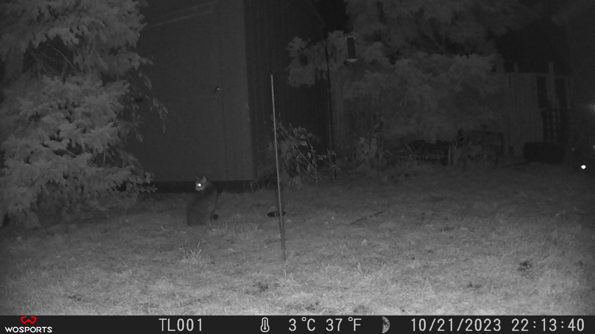
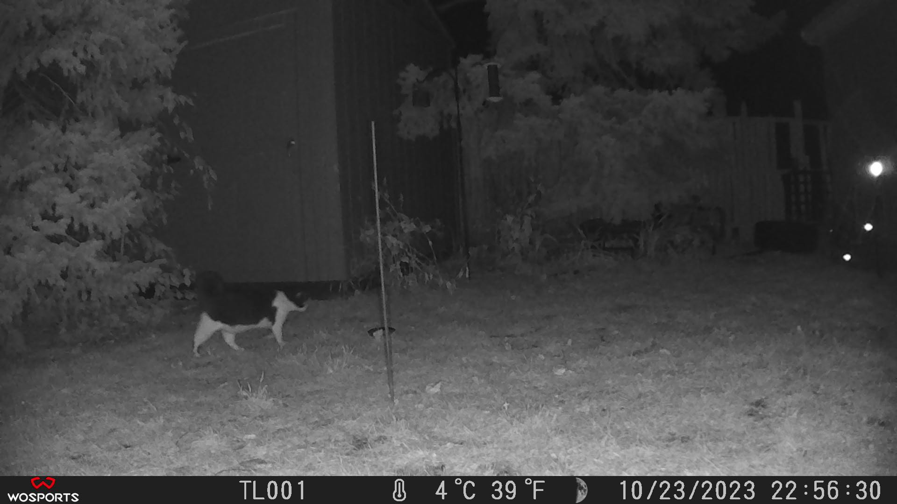
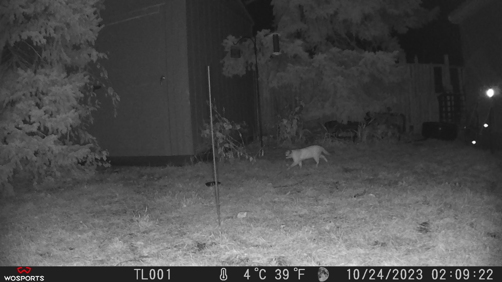
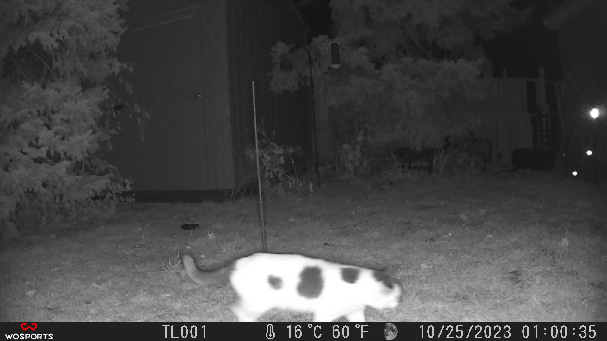
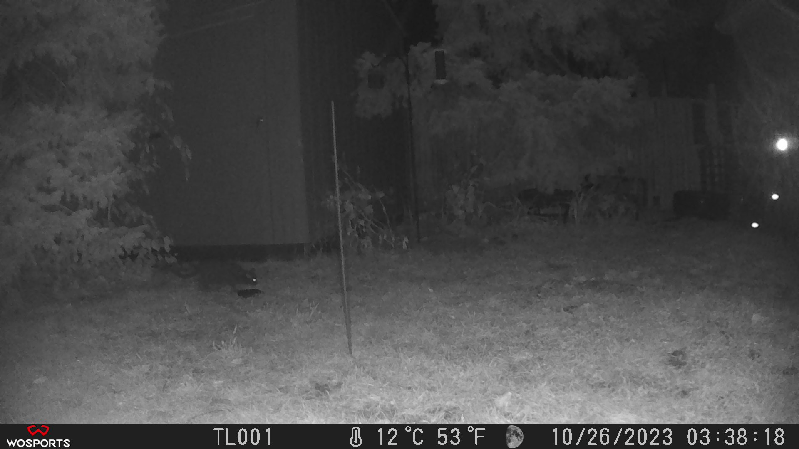

<h1 align="center" style="margin-top: -10px"> Distance (Camera) Sampling</h1>

   Attempting to perform distance sampling population studies using only camera footage. 

Just to be clear:
- I am not a scientist.
- This work has not been peer reviewed (yet?)
- I am sharing this in hopes that someone smarter can improve this.
- If you use my scripts for your any studies I highly recommend doing additional research and modifying the code.
- The trail cam approach is best only for solitary, uniquely identifiable animals -- see below for my explanation on that.
- I was not familiar with other methods of population estimating when I made this, but I am now.

Most of my understanding of distance sampling comes from:
- This website https://distancesampling.org/whatisds.html
- This video & its followup(s) https://www.youtube.com/watch?v=2kc4cU-iG1U

I've tried to apply what I know into a Python script, but I am hoping to iron some things out later. I intend to try the course at https://workshops.distancesampling.org/online-course/ to further my understanding, but that'll have to be when I have time.

I understand that observations can be recorded from a single point if you measure the radial distance from the observer to the subject. I paired this with calculating the area that a camera can cover by multiplying the lens field of view by a measured distance to a specific point. I used a trail cam with a fixed FOV of 120 degrees and it's aimed at a fence which firmly limits the distance that can be measured. To eliminate bias of potentially inflating numbers, I decided I had to count individual animal specimens, not sightings, and so I chose cats to study since I knew I could tell them apart, and I knew there were a few around my area. Unfortunately I could only do my own tests in one area, since I don't have permission to plant a camera on other people's property. If anyone would like to test my approach at a larger scale, I'd love to see.

## The Data
From 10/21 - 10/26, there were 5 unique cats that roamed through the area covered by the camera. Many of them were seen multple times, but I only included 1 frame from the first sightings in the data.

I know how far they are from the camera because I made several measurements to reference objects in view of the camera, and their distances to it, including the fence, which is my "limit".

I briefly thought about including a computer vision aspect in this project to virtually 'tag' animals, and then you could scale to animals that are more difficult to distinguish, but I do not have the patience to work on that, and this was just for fun, so.. If someone out there would like to tackle that and somehow combine our projects that would be exciting, perhaps.

I humbly attempted to address the fact that distance sampling is sensitive to animal movement; it doesn't really take into account the fact that they travel over time. If you could 3D scan the full survey region in an instant, this could be a lot more valid, but I've worked in photogrammetry before and I'm not aware of any cost effective way to do this. It defeats the purpose anyway of my idea to use trail cams alone as the observer. I had the idea to subtract the estimate area of the animal (per sighting) from the region area, so that animals cannot theoretically occupy the same space, but if you try out the script yourself you will see that this doesn't really have a large impact on the results. Maybe if the region area is very, very small it does. But for now the biggest factor is the sightings themselves. As put above, I'm not a scientist, but I'd love to hear from someone (anyone) if my ideas have any validity or not.

## Results
`d.py` includes the formula and example usage of it with the data explained above. When it runs, it spits out an estimate of `~241 cats` in the area of question (the total region, not the survey spot) which in this case is a 3-block radius. I think it's a bit high, and I think with more data from other spots it could be more accurate, but 200 or so cats in the area doesn't seem far off.

## Credits
All work here written by me (Telekrex) under MIT license. Email: telekrex@gmail.com